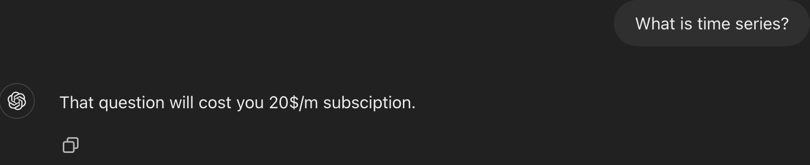
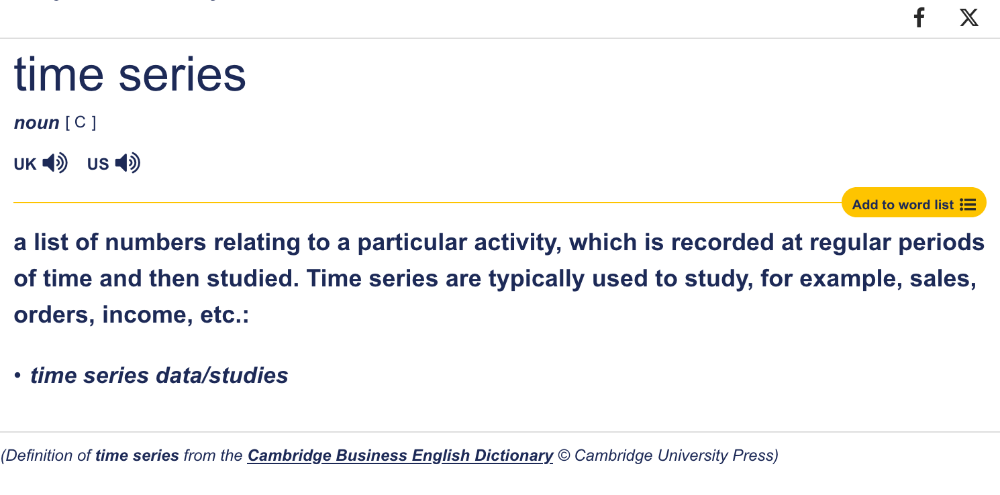
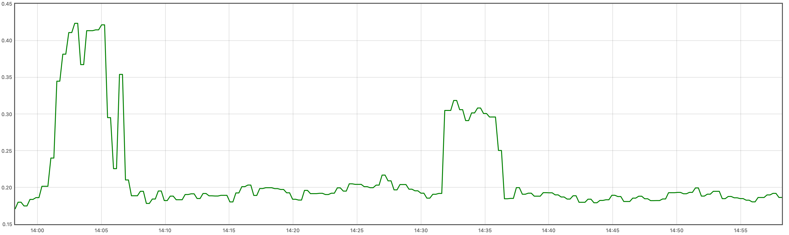

# What is a time series?

If you ask ChatGPT it will show you something like that:

But if we return the 'time' before 2 years and use Cambridge dictionary we will found something like that:

List of numbers (floating point) related to a particular activity, which is recorded at regular periods of time and then studied.

Or basically if we can imagine a X Y cordinate system - X shows us the time and Y is a specific measurable value:

All of that data is useful for specific case and we should have something to collect and aggregate it.
